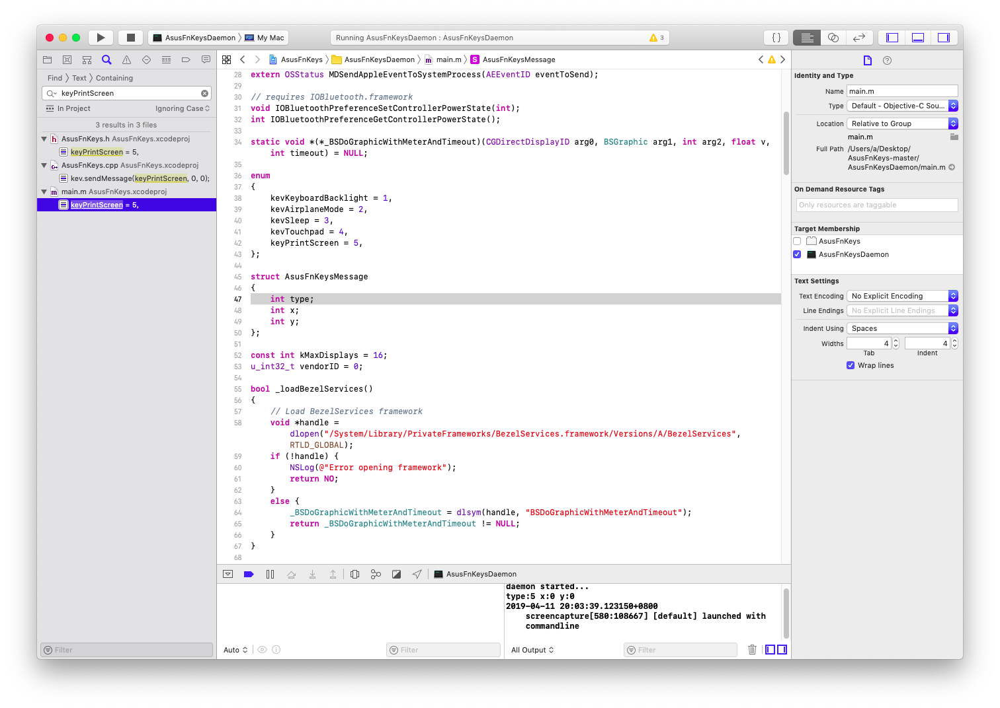

# ASUS S4000VA Hackintosh 黑苹果相关文件
## 简介 

这是华硕灵耀S4000VA（华硕超薄笔记本)的黑苹果相关文件, 这套配置我仅在苹果10.14(Macos Mojave)上测试完美 本人自己笔记本每个细节都查阅很多资料进行优化 完美度较高。

:warning: :warning: :warning: 

本项目提供的EFI并不能通用于所有的华硕笔记本，直接覆盖EFI分区可能导致无法启动等问题。推荐了解clover和黑苹果驱动的相关知识后，参考config.plist和驱动修改自己的EFI文件，切勿直接盲目使用。

有问题可以提issue，有时间我会尽可能的提供帮助。 
## 本机硬件
- CPU: intel i7-8550U
- 内存: 8GB板载
- 硬盘: 1. M.2 512G 镁光 SSD; 2. SATA 480GB 东芝 SSD
- 网卡/蓝牙：原始网卡无解，更换为BCM94352Z
- 显卡：HD620,无独显
## 哪些可以用？
- [x] CPU变频
- [x] 显卡硬件加速(QE/CI)
- [x] 亮度调节(小太阳)
- [x] Fn + F5,F6快捷键(小太阳) 自己动手编译AsusFnKeys
- [x] 音频完美(自己动手仿冒附源码及教程) 插耳机自动切换 麦克风完美
- [x] HDMI输出
- [x] USB3.0 USB2.0
- [x] WIFI/蓝牙(需更换网卡BCM94352Z后完美,天线长度不够切记多买跟天线)
- [x] 电量显示正常
- [x] 触控板（基本完美，但无法媲美白苹果）
- [x] 睡眠和唤醒
- [x] Fn快捷键 (带亮度调节)
## 等待修复的问题
- [ ] 快捷键Print sc这个键打印屏幕(能用但不完美 有兴趣自己编译修改我项目中的AsusFnKeys)

## Asus Laptop 华硕笔记本 hactosh
同为华硕笔记本配置相似y，以下给出友情链接

| 机型名称                          | 发布地址                                                     | 教程地址                                                     | 备注                                                       |
| --------------------------------- | ------------------------------------------------------------ | ------------------------------------------------------------ | ---------------------------------------------------------- |
| Asus A43SJ                        | [链接](https://github.com/badruzeus/Hackintosh-Asus-A43SJ)   | [链接](https://github.com/badruzeus/Hackintosh-Asus-A43SJ/blob/master/README.md) | Asus A43SJ                                                 |
| Asus A411UF                       | [链接](https://github.com/faizauthar12/Asus_A411UF_Hackintosh) |                                                              |                                                            |
| Asus A442UF                       | [链接](https://github.com/ryansat/Hackintosh-A442UF)         |                                                              |                                                            |
| Asus A455LA                       | [链接](https://github.com/brilliantedgar/Hackintosh-A455LA-Intel-Core-i3-5005U) | [链接](https://github.com/brilliantedgar/Hackintosh-A455LA-Intel-Core-i3-5005U/blob/master/README.md) | Asus S455LA                                                |
| Asus F455LD                       | [链接](https://github.com/athlonreg/Asus-F455LD-i5-4210u)    |                                                              |                                                            |
| Asus A455LF-WX039D Series         | [链接](https://github.com/asepms92/Hackintosh-Asus-A455LF-Notebook) |                                                              |                                                            |
| Asus FX504GE                      | [链接](https://github.com/PoomSmart/Asus-FX504GE-Hackintosh) |                                                              |                                                            |
| Asus FX504GE-ES72                 | [链接](https://github.com/MegaStood/Hackintosh-FX504GE-ES72) |                                                              |                                                            |
| Asus F556U (X556UQK)              | [链接](https://github.com/systemfaliure/Asus-X556UQK-hackintosh#Asus-f556u-x556uqk---high-sierra-hackintosh) | [链接](https://github.com/systemfaliure/Asus-X556UQK-hackintosh/blob/master/README.md) | Asus F556U (X556UQK)                                       |
| Asus FX50J                        | [链接](https://github.com/Xc2333/Hackintosh-Asus-FX50J)      |                                                              |                                                            |
| Asus FX533VD                      | [链接](https://github.com/kue-kid/Asus-FX533VD-HACKINTOSH)   |                                                              |                                                            |
| Asus GL551JW                      | [链接](https://github.com/zacharyrs/GL551JW-Hackintosh)      |                                                              |                                                            |
| Asus G60VW                        | [链接](https://github.com/PtNan/G60VW-Hackintosh)            |                                                              |                                                            |
| Asus K501LB                       | [链接](https://github.com/ApolloRisky/EFI_Clover-Asus-K501LB-Mojave) |                                                              |                                                            |
| Asus K55VD                        | [链接](https://github.com/southernvevo/Asus-K55VD-HACKINTOSH) | [链接](https://github.com/southernvevo/Asus-K55VD-HACKINTOSH/blob/master/README.md) | Asus K55VD                                                 |
| Asus Laptop N56VZ                 | [链接](https://github.com/signxer/N56VZ-Hackintosh)          |                                                              |                                                            |
| Asus P8P67 PRO                    | [链接](https://github.com/rafaelmaeuer/Asus-P8P67Pro-Hackintosh) | [链接](https://github.com/rafaelmaeuer/Asus-P8P67Pro-Hackintosh/blob/master/readme.md) |                                                            |
| Asus ROG GL552JX                  | [链接](https://github.com/javanesse/Asus-ROG-GL552JX-High-Sierra-10.13-Hackintosh) | [链接](https://github.com/javanesse/Asus-ROG-GL552JX-High-Sierra-10.13-Hackintosh/blob/master/README.md) | Asus ROG GL552JX                                           |
| Asus ROG GL552VX                  | [链接](https://github.com/xuanquydsr/Gl552VX-Mojave)         |                                                              |                                                            |
| Asus ROG GL553VD                  | [链接](https://github.com/MohammadtaghiFarkhondekar/macOS-Mojave-For-Asus-ROG-GL553VD) |                                                              |                                                            |
| Asus ROG Zephyrus S GX531GS       | [链接](https://github.com/williambj1/Hackintosh-EFI-Asus-Zephyrus-S-GX531) |                                                              | 华硕玩家国度冰刃 3                                         |
| Asus TUF Gaming FX504             | [链接](https://github.com/PoomSmart/Asus-FX504GE-Hackintosh) [链接](https://github.com/angeljavan/AUSU-FX80GE-FX504Ge-efi) | [链接](https://github.com/PoomSmart/Asus-FX504GE-Hackintosh/blob/master/README.md) | 华硕 FX80GE FX504GE                                        |
| Asus VivoBook 15 X510UQ / S5100UQ | [链接](https://github.com/wishayne/hackintosh-Asus-S5100UQ-X510UQ) |                                                              |                                                            |
| Asus X441U                        | [链接](https://github.com/jundanaalbasyir/Hackintosh-Asus-X441U) |                                                              |                                                            |
| Asus X441UB                       | [链接](https://github.com/alfinauzikri/Asus-X441UB-Hackintosh) |                                                              |                                                            |
| Asus VivoBook Max X441UVK         | [链接](https://github.com/alfinauzikri/Asus-X441UVK-Hackintosh) |                                                              |                                                            |
| Asus VivoBook S15 S510UA          | [链接](https://github.com/tctien342/Asus-Vivobook-S510UA-High-Sierra-10.13-Hackintosh) | [链接](https://github.com/tctien342/Asus-Vivobook-S510UA-High-Sierra-10.13-Hackintosh/blob/master/README.md) | Vivobook S510UA                                            |
| Asus Vivobook S510UA              |                                                              |                                                              |                                                            |
| Asus VivoBook X510UQR             | [链接](https://github.com/nguyentrucxinh/Asus-VivoBook-X510UQR-Hackintosh) | [链接](https://github.com/nguyentrucxinh/Asus-VivoBook-X510UQR-Hackintosh/blob/master/README.md) |                                                            |
| Asus X450JB                       | [链接](https://github.com/xiaoMGitHub/Asus_X450JB_Hackintosh) |                                                              |                                                            |
| Asus X550JX                       | [链接](https://github.com/gaoliang/Asus-X550JX-Hackintosh)   |                                                              |                                                            |
| Asus X555LB                       | [链接](https://github.com/emre1393/Asus-x555lb-mojave-efi)   |                                                              |                                                            |
| Asus ZenBook 系列                 | [链接](https://github.com/hieplpvip/Asus-ZENBOOK-HACKINTOSH) | [链接](https://www.tonymacx86.com/threads/guide-Asus-zenbook-using-clover-uefi-hotpatch.257448/) | 支持型号: UX310 - UX330 - UX330 UX410 - UX430 - UX430 |
| Asus ZenBook Flip UX360UAK        | [链接](https://github.com/Frizz925/UX360UAK-Hackintosh)      | [链接](https://github.com/Frizz925/UX360UAK-Hackintosh/blob/master/README.md) |                                                            |
| Asus ZenBook UX32VD               | [链接](https://github.com/rafaelmaeuer/Asus-UX32VD-Hackintosh) | [链接](https://github.com/rafaelmaeuer/Asus-UX32VD-Hackintosh/blob/master/readme.md) | Asus UX32VD                                                |
| Asus ZenBook UX330UAK             | [链接](https://github.com/Rybo713/UX330UA-macOS)             | [链接](https://github.com/Rybo713/UX330UA-macOS/blob/master/README.md) | Asus UX330UAK (Kabylake）                                  |
| 华硕zx50jx4200                    | [链接](https://github.com/sxz799/zx50jx4200_hackintosh)      |                                                              |                                                            |

####

