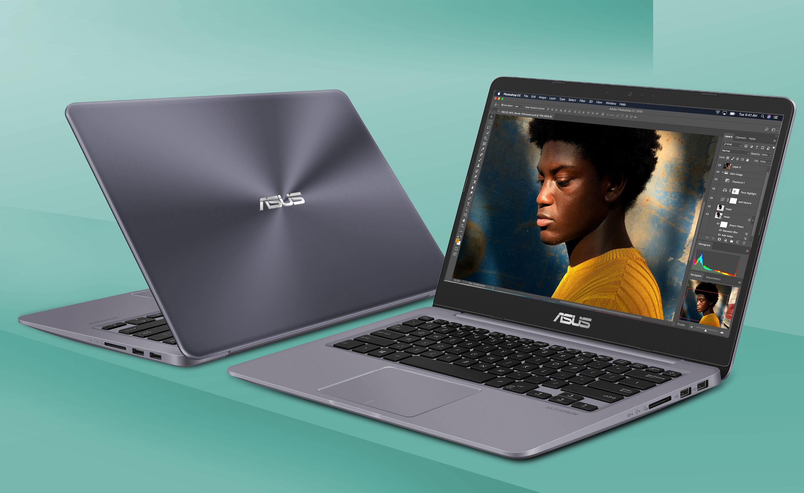

# ASUS S4000VA Hackintosh 黑苹果相关文件
## 简介 

这是华硕灵耀S4000VA（华硕超薄笔记本)的黑苹果相关文件, 这套配置我仅在苹果10.14，14.15，11.0.1(macOS Catalina，Mojave，和Big Sur)上测试完美 本人自己笔记本每个细节都查阅很多资料进行优化 完美度较高。

:warning: :warning: :warning: 

本项目使用Opencore 0.6.3引导 OC只测试过11.0.1正式版。
需要引导10.14或10.15的旧版系统 请移步到[release](https://github.com/stonexing/Asus-S4000VA8550-Hackintosh/releases)列表里查找旧版EFI

有问题可以提issue，有时间我会尽可能的提供帮助。 
## 本机硬件
- CPU: intel i7-8550U
- 内存: 8GB板载
- 硬盘: 1. M.2 512G 镁光 SSD; 2. SATA 480GB 东芝 SSD
- 网卡/蓝牙：原始网卡无解，更换为BCM94352Z (此网卡为第三方卡，需要用文件夹中的指定config替换)
- 显卡：HD620,无独显
## 哪些可以用？
- [x] CPU变频 （并不完美 还没找到原因 运行bug sur比较卡顿）
- [x] 显卡硬件加速(QE/CI)
- [x] 音频完美(自己动手仿冒附源码及教程) 插耳机自动切换 麦克风(需要加dsdt开机激活一次)
- [x] HDMI输出
- [x] USB3.0 USB2.0
- [x] WIFI/蓝牙(需更换网卡BCM94352Z后完美,天线长度不够切记多买跟天线)
- [x] 电量显示正常
- [x] 触控板（基本完美，但无法媲美白苹果, 需手动删除/S/L/E下的包含i2c的两个kext）
- [x] 睡眠和唤醒
## 等待修复的问题
- [] 亮度调节(小太阳)
- [] Fn + F5,F6快捷键(小太阳) 自己动手编译AsusFnKeys
- [] Fn快捷键 (带亮度调节)
- [ ] 快捷键Print sc这个键打印屏幕(能用但不完美 有兴趣自己编译修改我项目中的AsusFnKeys)

## Asus Laptop 华硕笔记本 hactosh
同为华硕笔记本配置相似y，以下给出友情链接

| 机型名称                          | 发布地址                                                     | 教程地址                                                     | 备注                                                       |
| --------------------------------- | ------------------------------------------------------------ | ------------------------------------------------------------ | ---------------------------------------------------------- |
| Asus S4100VN                       | [链接](https://github.com/loong1992/Asus_S4100VN8250U_Hackintosh) | [链接](https://github.com/loong1992/Asus_S4100VN8250U_Hackintosh/blob/master/README.md) |   S4000跟S4100基本一致我用它的EFI一样完美，另外他对无线网卡方案总结比较细致                   |
| Asus P8P67 PRO                   | [链接](https://github.com/rafaelmaeuer/Asus-P8P67Pro-Hackintosh)  | [链接](https://github.com/rafaelmaeuer/Asus-P8P67Pro-Hackintosh/blob/master/readme.md) |   此配置跟此笔记本无关，我台式机配置几乎一样 |
| Asus A411UF                         | [链接](https://github.com/faizauthar12/Asus_A411UF_Hackintosh) |                                                              |   S4000VA的主板型号为X411 配置接近                   |
| Asus ZenBook 系列               | [链接](https://github.com/hieplpvip/Asus-ZENBOOK-HACKINTOSH) | [链接](https://www.tonymacx86.com/threads/guide-Asus-zenbook-using-clover-uefi-hotpatch.257448/) | 华硕笔记本基本换汤不换药一套方案出了很多型号 你懂的  |

####

